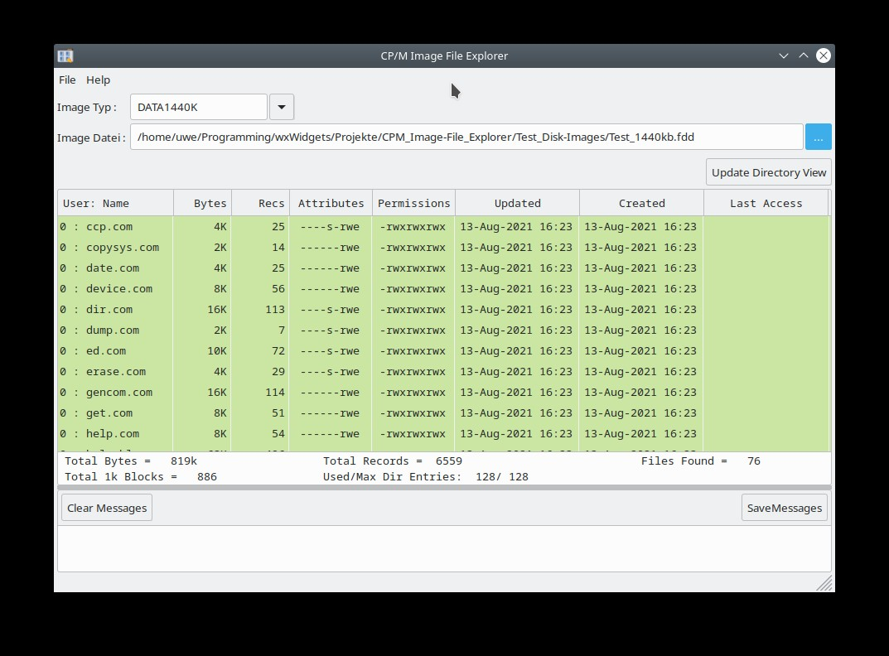

# CP/M Image File Explorer #

CP/M Image File Explorer dient zum einfachen Erzeugen und Bearbeiten von binären Disketten- und Festplatten-Images.

Der CP/M Image File Explorer basiert auf dem Source-Code der CP/M-Tools von Michael Haardt in der Version 2.21.

http://www.moria.de/~michael/cpmtools

Entwickelt wird der CP/M Image File Explorer in C/C++ mit den wxWidgets GUI-Framework.

Als Entwicklungsumgebung dient Eclipse CDT.

# Kompilieren von CIFE ohne Entwicklungsumgebung #
CIFE kann unter Linux auch ohne eine installierte Entwicklungsumgebung auf das jeweilige Zielsystem hin Kompiliert werden.
Dafür habe ich ein GNUmakefile angelegt. Voraussetzung ist der Linux Compiler GCC sowie die wxWidgets Development Pakete.

Unter Ubuntu können die Voraussetzungen in der Console mit folgender Zeile installiert werden:

sudo apt install build-essential libwxgtk3.0-gtk3-dev

Dann die Sourcen von CIFE von Github herunterladen und in der Stammordner in welchem sich das GNUmakefile befindet wechseln.

Dort reicht dann in der Console ein einfaches  make  um CIFE zu kompilieren.
